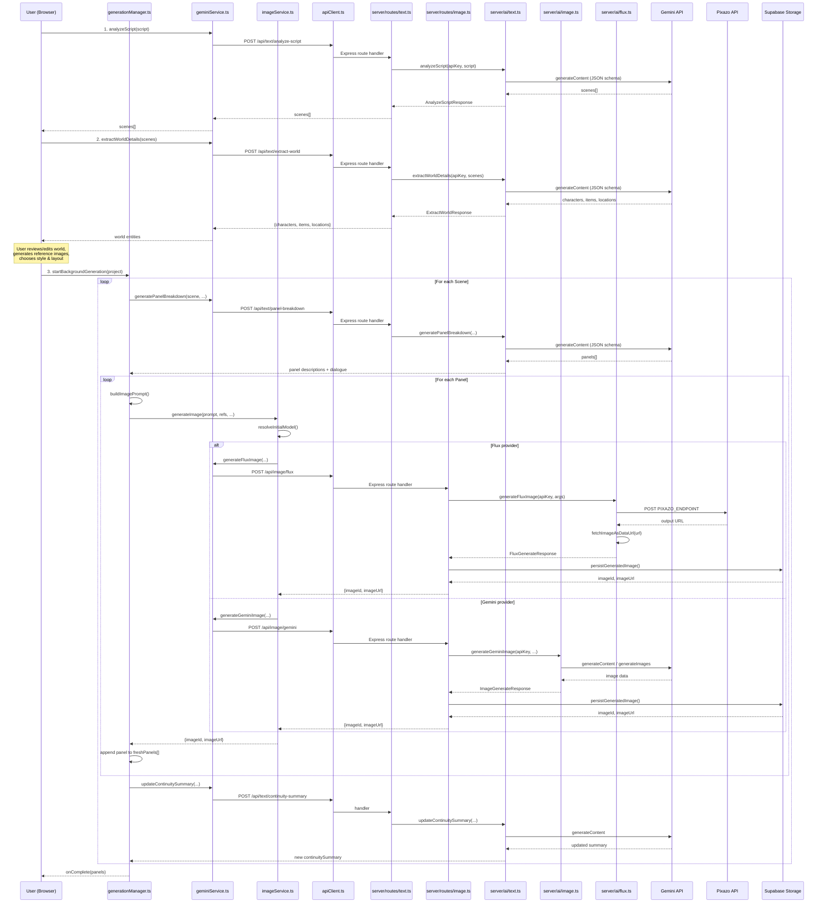
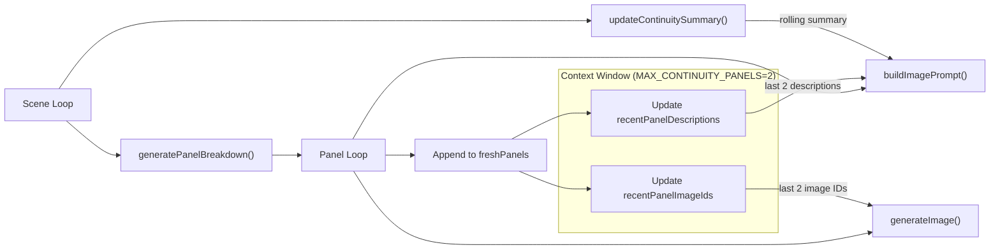

# DreamStream Comic Studio — AI Flow Technical Documentation

> Every factual claim is cited as `path/to/file.ext:Lx-Ly`. If a detail was not found in code/config, it is labelled **NOT FOUND IN CODE**.

---

## Table of Contents

1. [Execution Flow (Request → Comic Output)](#1-execution-flow)
2. [Context & Optimization](#2-context--optimization)
3. [Comic-Specific Consistency](#3-comic-specific-consistency)
4. [Critical Analysis + Concrete Optimizations](#4-critical-analysis--concrete-optimizations)

---

## 1. Execution Flow

### 1.1 End-to-End Sequence Diagram



### 1.2 Step-by-Step Flow

| # | Step | Trigger | Client File | Server Route | Server AI | Model |
|---|------|---------|-------------|-------------|-----------|-------|
| 1 | **Script Analysis** | User pastes script & clicks "Analyze" | [geminiService.ts:L219-231](file:///Users/Akhielesh/Coding%20Projects/Neural%20graph/Comic2/dreamstreamcomicstudio/services/geminiService.ts#L219-L231) | `POST /api/text/analyze-script` [routes/text.ts:L30-91](file:///Users/Akhielesh/Coding%20Projects/Neural%20graph/Comic2/dreamstreamcomicstudio/server/src/routes/text.ts#L30-L91) | [ai/text.ts:L37-96](file:///Users/Akhielesh/Coding%20Projects/Neural%20graph/Comic2/dreamstreamcomicstudio/server/src/ai/text.ts#L37-L96) | Gemini Text |
| 2 | **World Extraction** | User clicks "Extract World" | [geminiService.ts:L261-280](file:///Users/Akhielesh/Coding%20Projects/Neural%20graph/Comic2/dreamstreamcomicstudio/services/geminiService.ts#L261-L280) | `POST /api/text/extract-world` [routes/text.ts:L262-319](file:///Users/Akhielesh/Coding%20Projects/Neural%20graph/Comic2/dreamstreamcomicstudio/server/src/routes/text.ts#L262-L319) | [ai/text.ts:L231-339](file:///Users/Akhielesh/Coding%20Projects/Neural%20graph/Comic2/dreamstreamcomicstudio/server/src/ai/text.ts#L231-L339) | Gemini Text |
| 3 | **Reference Image Gen** | User clicks generate on character/location | [imageService.ts:L16-136](file:///Users/Akhielesh/Coding%20Projects/Neural%20graph/Comic2/dreamstreamcomicstudio/services/imageService.ts#L16-L136) | `POST /api/image/gemini` or `/api/image/flux` | [ai/image.ts:L83-234](file:///Users/Akhielesh/Coding%20Projects/Neural%20graph/Comic2/dreamstreamcomicstudio/server/src/ai/image.ts#L83-L234) / [ai/flux.ts:L139-245](file:///Users/Akhielesh/Coding%20Projects/Neural%20graph/Comic2/dreamstreamcomicstudio/server/src/ai/flux.ts#L139-L245) | Gemini Image / Flux |
| 4 | **Start Generation** | User clicks "Generate Comic" | [generationManager.ts:L48-361](file:///Users/Akhielesh/Coding%20Projects/Neural%20graph/Comic2/dreamstreamcomicstudio/services/generationManager.ts#L48-L361) | — | — | — |
| 4a | → **Panel Breakdown** | Per scene in loop | [generationManager.ts:L148-168](file:///Users/Akhielesh/Coding%20Projects/Neural%20graph/Comic2/dreamstreamcomicstudio/services/generationManager.ts#L148-L168) | `POST /api/text/panel-breakdown` [routes/text.ts:L321-392](file:///Users/Akhielesh/Coding%20Projects/Neural%20graph/Comic2/dreamstreamcomicstudio/server/src/routes/text.ts#L321-L392) | [ai/text.ts:L341-434](file:///Users/Akhielesh/Coding%20Projects/Neural%20graph/Comic2/dreamstreamcomicstudio/server/src/ai/text.ts#L341-L434) | Gemini Text |
| 4b | → **Image Generation** | Per panel in loop | [generationManager.ts:L243-264](file:///Users/Akhielesh/Coding%20Projects/Neural%20graph/Comic2/dreamstreamcomicstudio/services/generationManager.ts#L243-L264) | `POST /api/image/flux` or `/api/image/gemini` | See row 3 | Flux / Gemini Image |
| 4c | → **Continuity Update** | After each scene | [generationManager.ts:L323-328](file:///Users/Akhielesh/Coding%20Projects/Neural%20graph/Comic2/dreamstreamcomicstudio/services/generationManager.ts#L323-L328) | `POST /api/text/continuity-summary` [routes/text.ts:L453-510](file:///Users/Akhielesh/Coding%20Projects/Neural%20graph/Comic2/dreamstreamcomicstudio/server/src/routes/text.ts#L453-L510) | [ai/text.ts:L539-580](file:///Users/Akhielesh/Coding%20Projects/Neural%20graph/Comic2/dreamstreamcomicstudio/server/src/ai/text.ts#L539-L580) | Gemini Text |

### 1.3 Sync vs Async

The entire pipeline is **synchronous request/response** — there is **no async worker/queue system**.

- The `startBackgroundGeneration` function runs as an `async` function in the browser's JS event loop ([generationManager.ts:L48](file:///Users/Akhielesh/Coding%20Projects/Neural%20graph/Comic2/dreamstreamcomicstudio/services/generationManager.ts#L48)).
- It uses an `AbortController` for cancellation ([generationManager.ts:L58-59](file:///Users/Akhielesh/Coding%20Projects/Neural%20graph/Comic2/dreamstreamcomicstudio/services/generationManager.ts#L58-L59)).
- Each API call (text or image) is a blocking `await` to the Express server, which in turn `await`s the upstream AI provider.
- **NO** background job queue, worker pool, Redis queue, or message broker was found in code.

### 1.4 Models Registry

| Role | Provider | Model ID | Configured In |
|------|----------|----------|---------------|
| **Text LLM** (script analysis, panel breakdown, world extraction, continuity) | Google Gemini | `gemini-2.5-flash` | [modelPolicy.ts:L1](file:///Users/Akhielesh/Coding%20Projects/Neural%20graph/Comic2/dreamstreamcomicstudio/services/modelPolicy.ts#L1), [config.ts:L77](file:///Users/Akhielesh/Coding%20Projects/Neural%20graph/Comic2/dreamstreamcomicstudio/server/src/config.ts#L77) via `GEMINI_TEXT_MODEL` env |
| **Text LLM (alt)** | Google Gemini | `gemini-2.0-flash` | [modelPolicy.ts:L2-6](file:///Users/Akhielesh/Coding%20Projects/Neural%20graph/Comic2/dreamstreamcomicstudio/services/modelPolicy.ts#L2-L6) |
| **Text LLM (alt)** | Google Gemini | `gemini-2.5-flash-lite` | [modelPolicy.ts:L2-6](file:///Users/Akhielesh/Coding%20Projects/Neural%20graph/Comic2/dreamstreamcomicstudio/services/modelPolicy.ts#L2-L6) |
| **Image Generation (primary)** | Pixazo (Flux) | `pixazo/flux-1-schnell` | [imageModels.ts:L4](file:///Users/Akhielesh/Coding%20Projects/Neural%20graph/Comic2/dreamstreamcomicstudio/services/imageModels.ts#L4), [config.ts:L95](file:///Users/Akhielesh/Coding%20Projects/Neural%20graph/Comic2/dreamstreamcomicstudio/server/src/config.ts#L95) via `FLUX_MODEL_ID` env |
| **Image Generation (alt)** | Google Gemini | `gemini-2.5-flash-image` | [modelPolicy.ts:L7](file:///Users/Akhielesh/Coding%20Projects/Neural%20graph/Comic2/dreamstreamcomicstudio/services/modelPolicy.ts#L7), [config.ts:L78](file:///Users/Akhielesh/Coding%20Projects/Neural%20graph/Comic2/dreamstreamcomicstudio/server/src/config.ts#L78) via `GEMINI_IMAGE_MODEL` env |
| **Upscaler** | — | — | **NOT FOUND IN CODE** |
| **Captioner** | — | — | **NOT FOUND IN CODE** |
| **Safety Checker** | Google Gemini (built-in) | — | Built into Gemini `generateImages`; filtered via `raiFilteredReason` [ai/image.ts:L130](file:///Users/Akhielesh/Coding%20Projects/Neural%20graph/Comic2/dreamstreamcomicstudio/server/src/ai/image.ts#L130). No separate safety model. |

> [!NOTE]
> Flux is labelled as `isFree: true` in the model registry ([imageModels.ts:L18](file:///Users/Akhielesh/Coding%20Projects/Neural%20graph/Comic2/dreamstreamcomicstudio/services/imageModels.ts#L18)). Gemini Image supports reference images (`supportsReferences: true`, [imageModels.ts:L24](file:///Users/Akhielesh/Coding%20Projects/Neural%20graph/Comic2/dreamstreamcomicstudio/services/imageModels.ts#L24)); Flux does not.

---

## 2. Context & Optimization

### 2.1 Prompt Assembly Per Model Call

#### 2.1.1 Script Analysis (`analyzeScript`)

- **Prompt template**: Inline in [ai/text.ts:L40-49](file:///Users/Akhielesh/Coding%20Projects/Neural%20graph/Comic2/dreamstreamcomicstudio/server/src/ai/text.ts#L40-L49)
- **Inputs**: Raw user script (full text, **no truncation**)
- **Output schema**: JSON array with `id`, `rawText`, `synopsis`, `characters[]`, `setting` — enforced via `responseMimeType: 'application/json'` + `responseSchema` ([ai/text.ts:L57-71](file:///Users/Akhielesh/Coding%20Projects/Neural%20graph/Comic2/dreamstreamcomicstudio/server/src/ai/text.ts#L57-L71))
- **Retry**: 3 retries, 2000ms base delay ([ai/text.ts:L77-79](file:///Users/Akhielesh/Coding%20Projects/Neural%20graph/Comic2/dreamstreamcomicstudio/server/src/ai/text.ts#L77-L79))
- **Timeout**: `TEXT_REQUEST_TIMEOUT_MS` = 60s default ([config.ts:L82](file:///Users/Akhielesh/Coding%20Projects/Neural%20graph/Comic2/dreamstreamcomicstudio/server/src/config.ts#L82))

#### 2.1.2 World Extraction (`extractWorldDetails`)

- **Prompt template**: [ai/text.ts:L238-247](file:///Users/Akhielesh/Coding%20Projects/Neural%20graph/Comic2/dreamstreamcomicstudio/server/src/ai/text.ts#L238-L247)
- **Inputs**: Scene context string = `scenes.map(s => "Scene {id}: {synopsis} (Chars: {characters})")` ([ai/text.ts:L237](file:///Users/Akhielesh/Coding%20Projects/Neural%20graph/Comic2/dreamstreamcomicstudio/server/src/ai/text.ts#L237))
- **No truncation**: Full scene list is included.
- **Output schema**: JSON with `characters[]`, `items[]`, `locations[]` — each with `id`, `name`, `description` + `bio` for characters ([ai/text.ts:L254-297](file:///Users/Akhielesh/Coding%20Projects/Neural%20graph/Comic2/dreamstreamcomicstudio/server/src/ai/text.ts#L254-L297))

#### 2.1.3 Panel Breakdown (`generatePanelBreakdown`)

- **Prompt template**: [ai/text.ts:L358-385](file:///Users/Akhielesh/Coding%20Projects/Neural%20graph/Comic2/dreamstreamcomicstudio/server/src/ai/text.ts#L358-L385)
- **Inputs assembled**:
  - Scene synopsis, characters, setting
  - Style prompt (user-configured)
  - Layout type
  - **ContinuityBible entities** — full entity list with kind, name, description ([ai/text.ts:L369](file:///Users/Akhielesh/Coding%20Projects/Neural%20graph/Comic2/dreamstreamcomicstudio/server/src/ai/text.ts#L369))
  - **Scene continuity bindings** — required entity IDs, location IDs ([ai/text.ts:L371](file:///Users/Akhielesh/Coding%20Projects/Neural%20graph/Comic2/dreamstreamcomicstudio/server/src/ai/text.ts#L371))
  - **Previous panel context** — last `MAX_CONTINUITY_PANELS` (= 2) panels with description + dialogue ([generationManager.ts:L159-166](file:///Users/Akhielesh/Coding%20Projects/Neural%20graph/Comic2/dreamstreamcomicstudio/services/generationManager.ts#L159-L166), [ai/text.ts:L373](file:///Users/Akhielesh/Coding%20Projects/Neural%20graph/Comic2/dreamstreamcomicstudio/server/src/ai/text.ts#L373))

#### 2.1.4 Image Prompt (`buildImagePrompt`)

- **Assembly function**: [imagePrompt.ts:L31-80](file:///Users/Akhielesh/Coding%20Projects/Neural%20graph/Comic2/dreamstreamcomicstudio/services/imagePrompt.ts#L31-L80)
- **Invoked in**: [generationManager.ts:L218-232](file:///Users/Akhielesh/Coding%20Projects/Neural%20graph/Comic2/dreamstreamcomicstudio/services/generationManager.ts#L218-L232)
- **Inputs enumerated**:
  - `stage`: always `"panel"` for generation
  - `stylePrompt`: user's style setting (`state.stylePrompt`)
  - `layoutType`: user's layout or custom prompt
  - `characters`: **all** characters as `"Name: Description"` pairs joined by `". "` ([generationManager.ts:L213](file:///Users/Akhielesh/Coding%20Projects/Neural%20graph/Comic2/dreamstreamcomicstudio/services/generationManager.ts#L213))
  - `items`: **all** items as `"Name: Description"` joined ([generationManager.ts:L214](file:///Users/Akhielesh/Coding%20Projects/Neural%20graph/Comic2/dreamstreamcomicstudio/services/generationManager.ts#L214))
  - `locations`: **all** locations as `"Name: Description"` joined ([generationManager.ts:L215](file:///Users/Akhielesh/Coding%20Projects/Neural%20graph/Comic2/dreamstreamcomicstudio/services/generationManager.ts#L215))
  - `sceneAction`: panel description
  - `setting`: scene setting
  - `continuitySummary`: running continuity text
  - `recentPanels`: last `MAX_CONTINUITY_PANELS` (2) panel descriptions joined by `" | "` ([generationManager.ts:L216](file:///Users/Akhielesh/Coding%20Projects/Neural%20graph/Comic2/dreamstreamcomicstudio/services/generationManager.ts#L216))
  - `requiredEntityNames`: resolved from panel continuity entity IDs ([generationManager.ts:L206-208](file:///Users/Akhielesh/Coding%20Projects/Neural%20graph/Comic2/dreamstreamcomicstudio/services/generationManager.ts#L206-L208))
  - `lockedLocation`: locked location entity name
  - `continuityLock`: panel continuity notes or scene binding lock

- **Negative prompt** (`IMAGE_TEXT_BLOCKER`): Appended to all Gemini image requests ([geminiService.ts:L363](file:///Users/Akhielesh/Coding%20Projects/Neural%20graph/Comic2/dreamstreamcomicstudio/services/geminiService.ts#L363)) and to Flux requests ([imageService.ts:L69](file:///Users/Akhielesh/Coding%20Projects/Neural%20graph/Comic2/dreamstreamcomicstudio/services/imageService.ts#L69)). Value: `"No text, no letters, no speech bubbles..."` ([modelPolicy.ts:L11-12](file:///Users/Akhielesh/Coding%20Projects/Neural%20graph/Comic2/dreamstreamcomicstudio/services/modelPolicy.ts#L11-L12))

#### 2.1.5 Continuity Summary Update (`updateContinuitySummary`)

- **Prompt template**: [ai/text.ts:L548-560](file:///Users/Akhielesh/Coding%20Projects/Neural%20graph/Comic2/dreamstreamcomicstudio/server/src/ai/text.ts#L548-L560)
- **Inputs**:
  - Current running summary (or `"None"`)
  - New scene synopsis
  - All panels from the scene with `Panel {i+1}: {description} | {dialogue}`
- **Constraint**: Prompt says `"Keep it under 120 words"` — this is the **only context/token optimization** in the codebase

### 2.2 Token / Context Optimization

> [!IMPORTANT]
> There is **minimal explicit token/context optimization** in this codebase. Key observations:

| Mechanism | Detail | Citation |
|-----------|--------|----------|
| **Panel window** | Only last `MAX_CONTINUITY_PANELS = 2` panels are sent as context | [modelPolicy.ts:L8](file:///Users/Akhielesh/Coding%20Projects/Neural%20graph/Comic2/dreamstreamcomicstudio/services/modelPolicy.ts#L8), [generationManager.ts:L160](file:///Users/Akhielesh/Coding%20Projects/Neural%20graph/Comic2/dreamstreamcomicstudio/services/generationManager.ts#L160), [generationManager.ts:L216](file:///Users/Akhielesh/Coding%20Projects/Neural%20graph/Comic2/dreamstreamcomicstudio/services/generationManager.ts#L216) |
| **Summary word cap** | Continuity summary capped at 120 words (prompt instruction only) | [ai/text.ts:L550](file:///Users/Akhielesh/Coding%20Projects/Neural%20graph/Comic2/dreamstreamcomicstudio/server/src/ai/text.ts#L550) |
| **No script truncation** | Full script text is passed to `analyzeScript` | [ai/text.ts:L48](file:///Users/Akhielesh/Coding%20Projects/Neural%20graph/Comic2/dreamstreamcomicstudio/server/src/ai/text.ts#L48) |
| **No prompt size check** | None of the prompt builds check token count before sending | All prompt assembly functions |
| **No character/item limit** | **All** characters, items, locations are serialized in every panel prompt | [generationManager.ts:L213-215](file:///Users/Akhielesh/Coding%20Projects/Neural%20graph/Comic2/dreamstreamcomicstudio/services/generationManager.ts#L213-L215) |

### 2.3 State Management

#### Persisted (DB / Object Storage)

| Data | Storage | Citation |
|------|---------|----------|
| **Generated images** | Supabase Storage bucket `comic-assets`, path: `u/{userId}/p/{projectId}/img/{imageId}.webp` or `u/{userId}/tmp/{imageId}.webp` | [imageStorage.ts:L60-66](file:///Users/Akhielesh/Coding%20Projects/Neural%20graph/Comic2/dreamstreamcomicstudio/server/src/services/imageStorage.ts#L60-L66), [config.ts:L97](file:///Users/Akhielesh/Coding%20Projects/Neural%20graph/Comic2/dreamstreamcomicstudio/server/src/config.ts#L97) |
| **Image metadata** | Supabase `image_assets` table: `id`, `user_id`, `project_id`, `bucket`, `path`, `mime_type`, `bytes`, `width`, `height`, `source`, `created_at`, `last_referenced_at`, `expires_at`, `deleted_at` | [imageStorage.ts:L128-144](file:///Users/Akhielesh/Coding%20Projects/Neural%20graph/Comic2/dreamstreamcomicstudio/server/src/services/imageStorage.ts#L128-L144) |
| **Projects** (full state including panels, scenes, entities) | Supabase `projects` table with `state` JSON column; also fallback to IndexedDB for client-local | [db.ts:L184-199](file:///Users/Akhielesh/Coding%20Projects/Neural%20graph/Comic2/dreamstreamcomicstudio/services/db.ts) (ProjectRow type), [db.ts:L22-45](file:///Users/Akhielesh/Coding%20Projects/Neural%20graph/Comic2/dreamstreamcomicstudio/services/db.ts#L22-L45) (IndexedDB `openDb`) |
| **Generation artifacts** | IndexedDB `artifacts` store (client-side) | [db.ts:L22-45](file:///Users/Akhielesh/Coding%20Projects/Neural%20graph/Comic2/dreamstreamcomicstudio/services/db.ts#L22-L45), [geminiService.ts:L40-46](file:///Users/Akhielesh/Coding%20Projects/Neural%20graph/Comic2/dreamstreamcomicstudio/services/geminiService.ts#L40-L46) |
| **Billing ledger** | Supabase — managed by `billingLedger.ts` | [billingLedger.ts](file:///Users/Akhielesh/Coding%20Projects/Neural%20graph/Comic2/dreamstreamcomicstudio/server/src/services/billingLedger.ts) |
| **User settings** | `localStorage` keys: `dreamstream_settings`, `dreamstream_image_provider`, `dreamstream_model_keys`, `dreamstream_flux_key`, `dreamstream_image_model_id` | [appSettings.ts:L5-7,40](file:///Users/Akhielesh/Coding%20Projects/Neural%20graph/Comic2/dreamstreamcomicstudio/services/appSettings.ts#L5-L7) |

#### Ephemeral (In-Memory)

| Data | Scope | Citation |
|------|-------|----------|
| `generationControllers` (AbortController map) | Browser session | [generationManager.ts:L19](file:///Users/Akhielesh/Coding%20Projects/Neural%20graph/Comic2/dreamstreamcomicstudio/services/generationManager.ts#L19) |
| `generationCanceled` (Set) | Browser session | [generationManager.ts:L20](file:///Users/Akhielesh/Coding%20Projects/Neural%20graph/Comic2/dreamstreamcomicstudio/services/generationManager.ts#L20) |
| `currentStatus` (GenerationStatus) | Per generation run | [generationManager.ts:L61-70](file:///Users/Akhielesh/Coding%20Projects/Neural%20graph/Comic2/dreamstreamcomicstudio/services/generationManager.ts#L61-L70) |
| `freshPanels[]`, `recentPanelImageIds[]`, `recentPanelDescriptions[]`, `continuitySummary` | Per generation run | [generationManager.ts:L120-123](file:///Users/Akhielesh/Coding%20Projects/Neural%20graph/Comic2/dreamstreamcomicstudio/services/generationManager.ts#L120-L123) |
| `idempotencyResponseCache` (Map) | Server process | [routes/image.ts:L26-29](file:///Users/Akhielesh/Coding%20Projects/Neural%20graph/Comic2/dreamstreamcomicstudio/server/src/routes/image.ts#L26-L29) |
| `imageUrlCache` (Map, 15min TTL) | Browser session | [db.ts:L20](file:///Users/Akhielesh/Coding%20Projects/Neural%20graph/Comic2/dreamstreamcomicstudio/services/db.ts#L20) |
| Debug state | Browser session | [debugStore.ts](file:///Users/Akhielesh/Coding%20Projects/Neural%20graph/Comic2/dreamstreamcomicstudio/services/debugStore.ts) |

---

## 3. Comic-Specific Consistency

### 3.1 Visual Continuity

#### 3.1.1 ContinuityBible System

The core consistency mechanism is the **ContinuityBible** — a structured data object containing entities and scene-entity bindings.

**Construction**: [continuity.ts:L83-117](file:///Users/Akhielesh/Coding%20Projects/Neural%20graph/Comic2/dreamstreamcomicstudio/services/continuity.ts#L83-L117) — `buildContinuityBible()`

```
ContinuityBible = {
  version: number,
  entities: ContinuityEntity[],      // characters + items + locations
  sceneBindings: SceneContinuityBinding[],
  createdAt, updatedAt
}
```

Each `ContinuityEntity` includes:
- `lockedTraits[]`: First 5 clauses extracted from description ([continuity.ts:L29-37](file:///Users/Akhielesh/Coding%20Projects/Neural%20graph/Comic2/dreamstreamcomicstudio/services/continuity.ts#L29-L37))
- `referenceImageIds[]`: Deduplicated union of entity reference images + main image ([continuity.ts:L50](file:///Users/Akhielesh/Coding%20Projects/Neural%20graph/Comic2/dreamstreamcomicstudio/services/continuity.ts#L50))

**Scene binding**: Each scene gets mapped to its characters (by name match), items (by synopsis match), and a location ([continuity.ts:L54-81](file:///Users/Akhielesh/Coding%20Projects/Neural%20graph/Comic2/dreamstreamcomicstudio/services/continuity.ts#L54-L81)).

#### 3.1.2 Reference Image Injection

For each panel during generation, reference images are collected via `collectPanelReferenceImageIds()`:

1. Panel's own `continuity.referenceImageIds` 
2. All required entities' reference images (from `resolvePanelContinuity`)
3. Location entity's reference images
4. **Recent panel images** from the `recentPanelImageIds` sliding window (last `MAX_CONTINUITY_PANELS = 2`)

— [generationManager.ts:L238-241](file:///Users/Akhielesh/Coding%20Projects/Neural%20graph/Comic2/dreamstreamcomicstudio/services/generationManager.ts#L238-L241), [continuity.ts:L178-207](file:///Users/Akhielesh/Coding%20Projects/Neural%20graph/Comic2/dreamstreamcomicstudio/services/continuity.ts#L178-L207)

> [!IMPORTANT]
> Reference images are only usable with the **Gemini Image** model (`supportsReferences: true`). The **Flux Schnell** model does **not** support reference images ([imageModels.ts:L15](file:///Users/Akhielesh/Coding%20Projects/Neural%20graph/Comic2/dreamstreamcomicstudio/services/imageModels.ts#L15)). When Flux is selected and references exist, the system auto-falls back to Gemini ([imageService.ts:L44-49](file:///Users/Akhielesh/Coding%20Projects/Neural%20graph/Comic2/dreamstreamcomicstudio/services/imageService.ts#L44-L49)).

#### 3.1.3 Prompt-Level Consistency Enforcement

Several prompt-based consistency mechanisms:

| Mechanism | Where Applied | Citation |
|-----------|---------------|----------|
| `"Strict continuity mode"` instruction in image prompt | Panel stage | [imagePrompt.ts:L48-49](file:///Users/Akhielesh/Coding%20Projects/Neural%20graph/Comic2/dreamstreamcomicstudio/services/imagePrompt.ts#L48-L49) |
| `continuityLock` field in image prompt | Every panel | [generationManager.ts:L231](file:///Users/Akhielesh/Coding%20Projects/Neural%20graph/Comic2/dreamstreamcomicstudio/services/generationManager.ts#L231), [imagePrompt.ts:L76](file:///Users/Akhielesh/Coding%20Projects/Neural%20graph/Comic2/dreamstreamcomicstudio/services/imagePrompt.ts#L76) |
| `requiredEntityNames` in image prompt | Every panel | [generationManager.ts:L229](file:///Users/Akhielesh/Coding%20Projects/Neural%20graph/Comic2/dreamstreamcomicstudio/services/generationManager.ts#L229), [imagePrompt.ts:L74](file:///Users/Akhielesh/Coding%20Projects/Neural%20graph/Comic2/dreamstreamcomicstudio/services/imagePrompt.ts#L74) |
| `lockedLocation` in image prompt | Every panel | [generationManager.ts:L230](file:///Users/Akhielesh/Coding%20Projects/Neural%20graph/Comic2/dreamstreamcomicstudio/services/generationManager.ts#L230), [imagePrompt.ts:L75](file:///Users/Akhielesh/Coding%20Projects/Neural%20graph/Comic2/dreamstreamcomicstudio/services/imagePrompt.ts#L75) |
| Panel breakdown prompt: `"Do not introduce new characters..."` | Per scene | [ai/text.ts:L363](file:///Users/Akhielesh/Coding%20Projects/Neural%20graph/Comic2/dreamstreamcomicstudio/server/src/ai/text.ts#L363) |
| `IMAGE_TEXT_BLOCKER` negative prompt | All image calls | [modelPolicy.ts:L11-12](file:///Users/Akhielesh/Coding%20Projects/Neural%20graph/Comic2/dreamstreamcomicstudio/services/modelPolicy.ts#L11-L12) |

#### 3.1.4 NOT used for consistency

| Technique | Status |
|-----------|--------|
| **Seeds** | `seed` parameter exists in `FluxGenerateArgs` ([fluxService.ts:L22](file:///Users/Akhielesh/Coding%20Projects/Neural%20graph/Comic2/dreamstreamcomicstudio/services/fluxService.ts#L22)), but is **never set** during generation — always `undefined`. |
| **LoRA** | **NOT FOUND IN CODE** |
| **IP-Adapter / ControlNet** | **NOT FOUND IN CODE** |
| **Fixed templates** | **NOT FOUND IN CODE** |

#### 3.1.5 Continuity Validation

Before generation starts, `validateContinuityState()` checks:
- Bible exists
- Every scene has a binding
- All required entities exist
- All required entities have reference images
- Location bindings exist (strict mode)

If `lockLevel === "strict"` and validation fails, **generation is blocked** ([generationManager.ts:L96-113](file:///Users/Akhielesh/Coding%20Projects/Neural%20graph/Comic2/dreamstreamcomicstudio/services/generationManager.ts#L96-L113), [continuity.ts:L209-283](file:///Users/Akhielesh/Coding%20Projects/Neural%20graph/Comic2/dreamstreamcomicstudio/services/continuity.ts#L209-L283)).

### 3.2 Narrative Flow

#### 3.2.1 How Previous Panels Influence Current



**Mechanisms**:

1. **`previousPanelContext`** (text-based, into panel breakdown): Last 2 panels' `{panelId, sceneId, description, dialogue}` are sent to `generatePanelBreakdown` ([generationManager.ts:L159-166](file:///Users/Akhielesh/Coding%20Projects/Neural%20graph/Comic2/dreamstreamcomicstudio/services/generationManager.ts#L159-L166))

2. **`recentPanels`** (text-based, into image prompt): Last 2 panel descriptions joined by `" | "` and embedded in the image generation prompt ([generationManager.ts:L216](file:///Users/Akhielesh/Coding%20Projects/Neural%20graph/Comic2/dreamstreamcomicstudio/services/generationManager.ts#L216), [imagePrompt.ts:L73](file:///Users/Akhielesh/Coding%20Projects/Neural%20graph/Comic2/dreamstreamcomicstudio/services/imagePrompt.ts#L73))

3. **`continuitySummary`** (rolling text summary): After each scene completes, `updateContinuitySummary` asks Gemini to produce a ≤120-word summary incorporating the new scene. This summary is then fed into subsequent panel image prompts ([generationManager.ts:L323-331](file:///Users/Akhielesh/Coding%20Projects/Neural%20graph/Comic2/dreamstreamcomicstudio/services/generationManager.ts#L323-L331), [generationManager.ts:L227](file:///Users/Akhielesh/Coding%20Projects/Neural%20graph/Comic2/dreamstreamcomicstudio/services/generationManager.ts#L227))

4. **Reference image IDs** (visual, for Gemini only): Last 2 generated panel image IDs are collected and sent as reference images to the image model ([generationManager.ts:L238-241](file:///Users/Akhielesh/Coding%20Projects/Neural%20graph/Comic2/dreamstreamcomicstudio/services/generationManager.ts#L238-L241))

#### 3.2.2 Key Functions in Narrative Flow

| Function | File | Lines | Role |
|----------|------|-------|------|
| `startBackgroundGeneration` | generationManager.ts | L48-361 | Main orchestration loop |
| `generatePanelBreakdown` | ai/text.ts | L341-434 | LLM call for scene→panels |
| `buildImagePrompt` | imagePrompt.ts | L31-80 | Prompt string assembly |
| `buildContinuityBible` | continuity.ts | L83-117 | Entity-scene graph builder |
| `resolvePanelContinuity` | continuity.ts | L178-202 | Per-panel entity/ref resolution |
| `collectPanelReferenceImageIds` | continuity.ts | L204-207 | Reference image collector |
| `updateContinuitySummary` | ai/text.ts | L539-580 | Rolling summary updater |

---

## 4. Critical Analysis + Concrete Optimizations

### 4.1 Bottlenecks

| # | Issue | Severity | Location | Impact |
|---|-------|----------|----------|--------|
| B1 | **Strictly sequential panel generation** — each panel waits for the previous to complete. No parallelism within a scene. | 🔴 High | [generationManager.ts:L195-321](file:///Users/Akhielesh/Coding%20Projects/Neural%20graph/Comic2/dreamstreamcomicstudio/services/generationManager.ts#L195-L321) | A 12-panel comic (4 scenes × 3 panels) makes 12 sequential image API calls + 4 continuity updates = **16 sequential requests**. At ~5-10s per image, total: 60-120s+ |
| B2 | **Panel breakdown is sequential per scene** — cannot start planning scene N+1 until scene N's panels are all generated | 🟠 Medium | [generationManager.ts:L131-332](file:///Users/Akhielesh/Coding%20Projects/Neural%20graph/Comic2/dreamstreamcomicstudio/services/generationManager.ts#L131-L332) | Panel breakdown for scene 2 waits for all of scene 1's images |
| B3 | **All entities in every prompt** — every panel image prompt includes ALL characters, ALL items, ALL locations | 🟠 Medium | [generationManager.ts:L213-215](file:///Users/Akhielesh/Coding%20Projects/Neural%20graph/Comic2/dreamstreamcomicstudio/services/generationManager.ts#L213-L215) | Token waste; comics with many entities will have bloated prompts |
| B4 | **Reference images fetched serially as data URLs** — each reference image is resolved via `getImageDataUrl()` which may involve a Supabase download | 🟠 Medium | [geminiService.ts:L368](file:///Users/Akhielesh/Coding%20Projects/Neural%20graph/Comic2/dreamstreamcomicstudio/services/geminiService.ts#L368) | Large reference images + multiple entities can add seconds per panel |
| B5 | **Flux output image fetch** — extra HTTP round-trip to download the generated image from a CDN URL | 🟡 Low | [ai/flux.ts:L80-137](file:///Users/Akhielesh/Coding%20Projects/Neural%20graph/Comic2/dreamstreamcomicstudio/server/src/ai/flux.ts#L80-L137) | Adds 1-3s latency per Flux image |

### 4.2 Redundant / Wasteful Patterns

| # | Issue | Location | Proposal |
|---|-------|----------|----------|
| R1 | **Duplicate negative prompt injection**: `IMAGE_TEXT_BLOCKER` is appended both on client (Gemini path at [geminiService.ts:L363](file:///Users/Akhielesh/Coding%20Projects/Neural%20graph/Comic2/dreamstreamcomicstudio/services/geminiService.ts#L363)) and on client (Flux path at [imageService.ts:L69](file:///Users/Akhielesh/Coding%20Projects/Neural%20graph/Comic2/dreamstreamcomicstudio/services/imageService.ts#L69) via `fluxService.ts:L53`). The Flux service also does its own append at [fluxService.ts:L53](file:///Users/Akhielesh/Coding%20Projects/Neural%20graph/Comic2/dreamstreamcomicstudio/services/fluxService.ts#L53) and the server Flux backend again at [ai/flux.ts:L156](file:///Users/Akhielesh/Coding%20Projects/Neural%20graph/Comic2/dreamstreamcomicstudio/server/src/ai/flux.ts#L156). | Consolidate negative prompt to a single injection point (server-side only) |
| R2 | **All entities in every panel prompt** even when only 1-2 characters appear in a scene | [generationManager.ts:L213-215](file:///Users/Akhielesh/Coding%20Projects/Neural%20graph/Comic2/dreamstreamcomicstudio/services/generationManager.ts#L213-L215) | Filter entities to only those in the scene's `SceneContinuityBinding` |
| R3 | **Artifact recording ignores failures silently** — `void recordArtifact(...)` with swallowed errors | [geminiService.ts:L40-46](file:///Users/Akhielesh/Coding%20Projects/Neural%20graph/Comic2/dreamstreamcomicstudio/services/geminiService.ts#L40-L46), [fluxService.ts:L9-15](file:///Users/Akhielesh/Coding%20Projects/Neural%20graph/Comic2/dreamstreamcomicstudio/services/fluxService.ts#L9-L15) | Not a performance issue, but artifact data loss. Add structured logging |

### 4.3 Missing Caching

| # | What's Missing | Location | Proposal |
|---|---------------|----------|----------|
| C1 | **No panel breakdown cache** — re-generating a comic re-plans all scenes | [generationManager.ts:L142-143](file:///Users/Akhielesh/Coding%20Projects/Neural%20graph/Comic2/dreamstreamcomicstudio/services/generationManager.ts#L142-L143) | Cache panel breakdowns keyed by `(sceneId, style, layout, continuityBible hash)`. Only existing panels are checked, not cached breakdowns. |
| C2 | **No prompt deduplication** — if regenerating a single panel, the entire entity context is recomputed | `buildImagePrompt` is always called fresh | Pre-compute and cache entity context per scene |
| C3 | **Idempotency cache is in-memory only** (server) — lost on restarts, 2MB cap | [routes/image.ts:L26-29](file:///Users/Akhielesh/Coding%20Projects/Neural%20graph/Comic2/dreamstreamcomicstudio/server/src/routes/image.ts#L26-L29) | Use Redis or DB-backed idempotency for production |

### 4.4 Concurrency Issues

| # | Issue | Location |
|---|-------|----------|
| CC1 | **Concurrent generation runs possible** — no mutex on `project.id`; user could trigger `startBackgroundGeneration` twice | [generationManager.ts:L48](file:///Users/Akhielesh/Coding%20Projects/Neural%20graph/Comic2/dreamstreamcomicstudio/services/generationManager.ts#L48) — `generationCanceled.delete(project.id)` clears previous cancel but doesn't prevent re-entry |
| CC2 | **In-memory idempotency state not shared** across server instances | [routes/image.ts:L26](file:///Users/Akhielesh/Coding%20Projects/Neural%20graph/Comic2/dreamstreamcomicstudio/server/src/routes/image.ts#L26) |

### 4.5 Concrete Improvement Proposals

#### P1: Parallel Panel Image Generation (Cost: Medium | Impact: 🔴 High — 3-5× speedup)

**What**: Generate images for panels within a single scene concurrently using `Promise.allSettled`.

**Where**: [generationManager.ts:L195-321](file:///Users/Akhielesh/Coding%20Projects/Neural%20graph/Comic2/dreamstreamcomicstudio/services/generationManager.ts#L195-L321) — convert the `for...of` panel loop to batched parallel calls.

**Tradeoff**: This breaks the sequential `recentPanelImageIds` sliding window (panels after the first in a batch won't have previous panel references). Mitigation: batch size of 2-3 with entity-ref-only consistency.

#### P2: Scene-Level Pipeline Overlap (Cost: Medium | Impact: 🟠 — 20-30% speedup)

**What**: Start `generatePanelBreakdown` for scene N+1 while scene N's images are still generating.

**Where**: [generationManager.ts:L131](file:///Users/Akhielesh/Coding%20Projects/Neural%20graph/Comic2/dreamstreamcomicstudio/services/generationManager.ts#L131) — restructure the scene loop to pipeline planning and generation.

#### P3: Filter Entities to Scene Scope (Cost: Low | Impact: 🟠 — prompt quality + token savings)

**What**: Replace the "all entities" context with only the entities bound to the current scene.

**Where**: [generationManager.ts:L213-215](file:///Users/Akhielesh/Coding%20Projects/Neural%20graph/Comic2/dreamstreamcomicstudio/services/generationManager.ts#L213-L215)

```diff
-const characterContext = state.characters.map(c => `${c.name}: ${c.description}`).join('. ');
+const boundCharacterIds = new Set(sceneBinding?.characterIds || []);
+const characterContext = state.characters
+  .filter(c => boundCharacterIds.has(c.id))
+  .map(c => `${c.name}: ${c.description}`).join('. ');
```

#### P4: Reference Image Pre-fetch (Cost: Low | Impact: 🟡 — latency reduction)

**What**: Pre-fetch all entity reference image data URLs at the start of generation, not on each panel.

**Where**: Before the scene loop in [generationManager.ts:L131](file:///Users/Akhielesh/Coding%20Projects/Neural%20graph/Comic2/dreamstreamcomicstudio/services/generationManager.ts#L131).

#### P5: Add Instrumentation / Metrics (Cost: Low | Impact: 🟢 — observability)

**Current metrics**: Only `console.info('[METRICS] image_pipeline', {...})` in image routes ([routes/image.ts:L237-243](file:///Users/Akhielesh/Coding%20Projects/Neural%20graph/Comic2/dreamstreamcomicstudio/server/src/routes/image.ts#L237-L243), [routes/image.ts:L371-377](file:///Users/Akhielesh/Coding%20Projects/Neural%20graph/Comic2/dreamstreamcomicstudio/server/src/routes/image.ts#L371-L377)). **NO METRICS IN CODE** for:
- Total generation time end-to-end
- Per-scene breakdown/image timing
- Text model response latency
- Token usage per call
- Prompt size in characters/tokens

**Proposed instrumentation points**:

| Point | File | Line |
|-------|------|------|
| Generation start/end timestamp | generationManager.ts | L54, L344 |
| Per-panel image latency | generationManager.ts | L243 (wrap `generateImage` timing) |
| Panel breakdown latency | generationManager.ts | L148 (wrap `generatePanelBreakdown` timing) |
| Continuity update latency | generationManager.ts | L323 |
| Prompt character count | imagePrompt.ts | L80 (add `prompt.length` metric) |
| Reference image count + fetch time | geminiService.ts | L368 |

#### P6: Consolidate Negative Prompt Logic (Cost: Low | Impact: 🟢 — cleanliness)

**What**: Remove duplicate `IMAGE_TEXT_BLOCKER` appending. Apply it once, server-side.

**Where**: Remove from [geminiService.ts:L363](file:///Users/Akhielesh/Coding%20Projects/Neural%20graph/Comic2/dreamstreamcomicstudio/services/geminiService.ts#L363) and [imageService.ts:L69](file:///Users/Akhielesh/Coding%20Projects/Neural%20graph/Comic2/dreamstreamcomicstudio/services/imageService.ts#L69). Keep only in [ai/flux.ts:L156](file:///Users/Akhielesh/Coding%20Projects/Neural%20graph/Comic2/dreamstreamcomicstudio/server/src/ai/flux.ts#L156) and add to [ai/image.ts](file:///Users/Akhielesh/Coding%20Projects/Neural%20graph/Comic2/dreamstreamcomicstudio/server/src/ai/image.ts) server-side.

#### P7: Seed Persistence for Flux (Cost: Low | Impact: 🟠 — consistency improvement)

**What**: Pass a deterministic seed (e.g., hash of scene ID + panel index) to Flux calls for reproducible results.

**Where**: [generationManager.ts:L243](file:///Users/Akhielesh/Coding%20Projects/Neural%20graph/Comic2/dreamstreamcomicstudio/services/generationManager.ts#L243) — add `seed` to the options passed through to `generateImage` → `fluxService.ts`.

---

## Appendix: File Index

| File | Role |
|------|------|
| [generationManager.ts](file:///Users/Akhielesh/Coding%20Projects/Neural%20graph/Comic2/dreamstreamcomicstudio/services/generationManager.ts) | Main orchestrator — scene/panel loops |
| [geminiService.ts](file:///Users/Akhielesh/Coding%20Projects/Neural%20graph/Comic2/dreamstreamcomicstudio/services/geminiService.ts) | Client-side API wrapper for all Gemini calls |
| [imageService.ts](file:///Users/Akhielesh/Coding%20Projects/Neural%20graph/Comic2/dreamstreamcomicstudio/services/imageService.ts) | Image model router + fallback chain |
| [fluxService.ts](file:///Users/Akhielesh/Coding%20Projects/Neural%20graph/Comic2/dreamstreamcomicstudio/services/fluxService.ts) | Client-side Flux image call |
| [imagePrompt.ts](file:///Users/Akhielesh/Coding%20Projects/Neural%20graph/Comic2/dreamstreamcomicstudio/services/imagePrompt.ts) | Image prompt builder |
| [continuity.ts](file:///Users/Akhielesh/Coding%20Projects/Neural%20graph/Comic2/dreamstreamcomicstudio/services/continuity.ts) | ContinuityBible, entity binding, validation |
| [modelPolicy.ts](file:///Users/Akhielesh/Coding%20Projects/Neural%20graph/Comic2/dreamstreamcomicstudio/services/modelPolicy.ts) | Default model IDs, constants |
| [imageModels.ts](file:///Users/Akhielesh/Coding%20Projects/Neural%20graph/Comic2/dreamstreamcomicstudio/services/imageModels.ts) | Image model registry |
| [appSettings.ts](file:///Users/Akhielesh/Coding%20Projects/Neural%20graph/Comic2/dreamstreamcomicstudio/services/appSettings.ts) | User settings + task-based model routing |
| [config.ts](file:///Users/Akhielesh/Coding%20Projects/Neural%20graph/Comic2/dreamstreamcomicstudio/server/src/config.ts) | Server env var config |
| [ai/text.ts](file:///Users/Akhielesh/Coding%20Projects/Neural%20graph/Comic2/dreamstreamcomicstudio/server/src/ai/text.ts) | Server-side Gemini text AI functions |
| [ai/image.ts](file:///Users/Akhielesh/Coding%20Projects/Neural%20graph/Comic2/dreamstreamcomicstudio/server/src/ai/image.ts) | Server-side Gemini image generation |
| [ai/flux.ts](file:///Users/Akhielesh/Coding%20Projects/Neural%20graph/Comic2/dreamstreamcomicstudio/server/src/ai/flux.ts) | Server-side Flux/Pixazo integration |
| [ai/client.ts](file:///Users/Akhielesh/Coding%20Projects/Neural%20graph/Comic2/dreamstreamcomicstudio/server/src/ai/client.ts) | GoogleGenAI client factory |
| [ai/utils.ts](file:///Users/Akhielesh/Coding%20Projects/Neural%20graph/Comic2/dreamstreamcomicstudio/server/src/ai/utils.ts) | Retry + timeout utilities |
| [routes/text.ts](file:///Users/Akhielesh/Coding%20Projects/Neural%20graph/Comic2/dreamstreamcomicstudio/server/src/routes/text.ts) | Text API route handlers |
| [routes/image.ts](file:///Users/Akhielesh/Coding%20Projects/Neural%20graph/Comic2/dreamstreamcomicstudio/server/src/routes/image.ts) | Image API route handlers |
| [imageStorage.ts](file:///Users/Akhielesh/Coding%20Projects/Neural%20graph/Comic2/dreamstreamcomicstudio/server/src/services/imageStorage.ts) | Image persistence (sharp + Supabase) |
| [db.ts](file:///Users/Akhielesh/Coding%20Projects/Neural%20graph/Comic2/dreamstreamcomicstudio/services/db.ts) | Client DB layer (IndexedDB + Supabase) |
