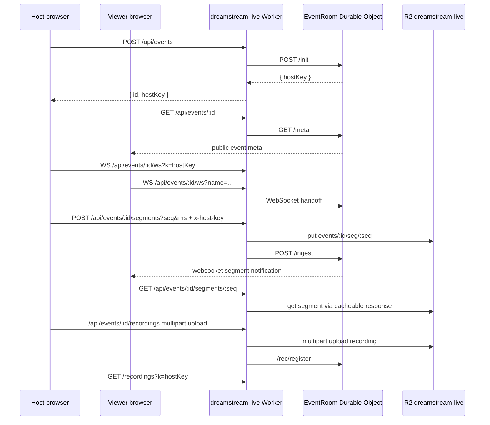

# Stream Studio System Map

> Status: launch-readiness map for the June 25 Stream Studio MVP.
> Last updated: 2026-06-18 from repo evidence and live smoke probes.

This map exists so the launch council, sprint engine, and humans reason from the same architecture instead of rediscovering it each run.

## 1. Launch wedge

Stream Studio is the June 25 MVP wedge:

> Private creator live events from browser setup to viewer link to recording/replay.

Chat and Comic Studio are support surfaces. Code Studio / container-heavy workflows are out of the launch funnel until Stream Studio is proven.

## 2. Public routes and current launch status

| Surface | URL | Expected owner | Current status |
|---|---|---|---|
| Primary marketing/app domain | `https://dreamstreamstudio.ai/` | Cloudflare Pages (`comic2`) | Blocked by Cloudflare security verification for automation; must be manually verified/fixed before canonical launch. |
| Temporary launch app domain | `https://comic2.pages.dev/` | Cloudflare Pages (`comic2`) | Returns app shell. Current temporary marketing/app URL. |
| Temporary Stream Studio app | `https://comic2.pages.dev/live.html` | Cloudflare Pages (`comic2`) | Returns app shell. |
| Temporary Stream Studio API | `https://dreamstream-live.akhieleshsrirangam.workers.dev/api/events/...` from the deployed `comic2.pages.dev/live.html` bundle | `dreamstream-live` Worker on workers.dev | Reachable; `npm run ops:live-smoke:temporary` verifies the Pages shell, deployed bundle worker base, no-write worker probe, and Railway health. |
| Configured custom-domain live-worker route | `https://dreamstreamstudio.ai/live-api/api/events/...` | `dreamstream-live` Worker | **Blocked:** currently returns Cloudflare challenge HTML, not live-worker JSON. |
| Railway backend health | `https://comic2-production.up.railway.app/api/health` | Railway service `Comic2` | Returns health JSON. |

## 3. High-level topology

```mermaid
flowchart LR
  U[Creator / Viewer Browser]
  Pages[Cloudflare Pages\ncomic2.pages.dev / dreamstreamstudio.ai]
  LiveHtml[/live.html\nStream Studio shell]
  LiveClient[live/* React app]
  LiveAPI[dreamstream-live Worker\n/live-api/*]
  DO[(EventRoom Durable Object\n1 per event)]
  R2[(R2 bucket\ndreamstream-live)]
  Supabase[(Supabase Comic\nAuth + owner-scoped tables)]
  Railway[Railway Express backend\nComic2]

  U --> Pages
  Pages --> LiveHtml
  LiveHtml --> LiveClient
  LiveClient -->|create/get/stats/rsvp/recording/segments| LiveAPI
  LiveClient -->|account sync / product access| Supabase
  LiveClient -->|main app APIs outside live| Railway
  LiveAPI --> DO
  LiveAPI --> R2
  DO -->|chat, lobby, presence, stream state, stats, janitor| DO
  R2 -->|segments + server recordings| U
```

## 4. Frontend Stream Studio app graph

| File | Responsibility | Launch relevance |
|---|---|---|
| `live.html` | Entry HTML with `#live-root`; loads `/live/main.tsx`. | App shell smoke target. |
| `live/LiveApp.tsx` | URL/router shell. `?e=ID&k=KEY` = host studio, `?e=ID` = invite/watch, hash routes for dashboard/create/settings/summary. | Defines first-session flow. |
| `live/config.ts` | Quality limits, platform limits, and `WORKER_BASE`. Default production base is same-origin `${location.origin}/live-api`; localhost uses `127.0.0.1:8788`; `comic2.pages.dev` temporarily resolves to `dreamstream-live.akhieleshsrirangam.workers.dev`; optional `VITE_LIVE_WORKER_URL` override. | Defines the current temporary-domain API contract and the custom-domain route once Cloudflare challenge is fixed. |
| `live/api.ts` | REST/WebSocket client for live-worker; includes `probeLiveWorker`, Cloudflare/app-shell detection, event create/get/stats/rsvp/recordings/segments. | Prevents users from entering dead flows when backend route is miswired. |
| `live/events.ts` | Local event registry in `localStorage`; hostKey is a capability credential stored with local event history. | Host-key handling / shared-device risk. |
| `live/sync.ts` | Supabase account sync for events/settings and `product_access`/legacy access gate. Signed-out users degrade to local-only mode. | Cross-device dashboard + access-gated onboarding. |
| `live/views/CreateView.tsx` | Event creation UX and backend preflight. | First success moment; blocked if live-worker route fails. |
| `live/views/DashboardView.tsx` | Event list/status hydration and backend readiness surfacing. | Creator control center. |
| `live/views/StudioView.tsx` | Host studio, stream control, upload, guest management, recordings. | Core paid-value workflow. |
| `live/views/ViewerView.tsx` | Viewer join/playback/chat/reactions. | User-facing quality proof. |
| `live/views/EventPage.tsx` | Invite/RSVP/scheduled event page. | Share-link funnel. |
| `live/views/SummaryView.tsx` | Post-event recap/stats/recordings. | Retention value / repeat intent. |

## 5. Live-worker API graph

Source: `live-worker/src/index.ts` and `live-worker/src/eventRoom.ts`.



### Worker routes implemented

| Method/path | Purpose | Auth model |
|---|---|---|
| `POST /api/events` | Create event and hostKey. | No account auth; hostKey generated by DO. |
| `GET /api/events/:id` | Public event metadata. | Public. |
| `GET /api/events/:id/ws` | WebSocket to EventRoom for host/mod/guest/viewer. | Query keys / role-specific secrets. |
| `POST /api/events/:id/segments?seq&ms` | Host uploads stream segment. | `x-host-key`. |
| `GET /api/events/:id/segments/:seq` | Viewer fetches CDN-cached segment from R2. | Public by event link. |
| `GET /api/events/:id/stats?k=hostKey` | Host analytics/activity log. | Host key in query. |
| `POST /api/events/:id/rsvp` | Name-only RSVP from invite page. | Public. |
| `/api/events/:id/recordings` | Multipart server-side recording store/list/download. | `x-host-key` or `k=hostKey`. |
| `POST /api/events/:id/exit?k=hostKey` | Host pagehide beacon to auto-end stream. | Host key in query because `sendBeacon` cannot set headers. |

## 6. Durable Object responsibilities

`EventRoom` owns the live event state:

- stream status: `idle`, `live`, `paused`, `ended`;
- chat ring buffer and moderation state;
- lobby/approval, presence, viewer cap, roles;
- guest signaling frames;
- segment fan-out notifications;
- stats curves and host health telemetry;
- RSVP list;
- server recording registry;
- cleanup alarms: 24-hour replay segment purge, 7-day recording purge;
- host-gone grace window and cost guardrail.

Launch-critical constants from `eventRoom.ts`:

| Constant | Value | Meaning |
|---|---:|---|
| `HARD_VIEWER_CAP` | 200 | Hard concurrent viewer ceiling. Do not market as proven until load-tested. |
| `MAX_GUESTS` | 4 | On-air guest limit. |
| `REPLAY_WINDOW_MS` | 24h | Segment replay window. |
| `RECORDING_RETENTION_MS` | 7d | Server recording retention. |
| `HOST_GONE_GRACE_MS` | 2m | Auto-end after host disappears. |

## 7. Account and data model

| Layer | Table/storage | Data | Security model |
|---|---|---|---|
| Browser local | `localStorage: ds-live-my-events` | Event IDs + hostKeys + cached metadata. | Device-local; hostKey is a capability secret. |
| Browser local | `localStorage: ds-live-viewer-name` | Viewer display name. | Device-local convenience. |
| Supabase | `stream_studio_events` | Signed-in creator event history including hostKey. | RLS owner-only. Anon table privileges revoked. |
| Supabase | `stream_studio_settings` | Signed-in creator preferences. | Owner-scoped in app code; verify live RLS before broad launch. |
| Supabase | `product_access` | Product onboarding / standalone access gate. | Admin-managed. |
| Supabase legacy | `stream_studio_access` | Legacy stream access gate. | User read own grant; writes revoked from anon/authenticated. |
| Cloudflare R2 | `dreamstream-live` | Stream segments + server recordings. | Worker-mediated; retention bounded by DO alarm. |

## 8. Deployment/config map

| Component | Repo config | Live dependency | Current issue |
|---|---|---|---|
| Frontend Pages | Cloudflare Pages project `comic2` from `Dreamstrream-v1` | `comic2.pages.dev`, `dreamstreamstudio.ai` | Fallback domain works; custom domain challenged. |
| Live worker | `live-worker/wrangler.jsonc` + `live/config.ts` fallback | Workers.dev fallback for `comic2.pages.dev`; custom route `dreamstreamstudio.ai/live-api/*`, DO `EVENT_ROOM`, R2 `dreamstream-live`, `ALLOWED_ORIGINS` includes both domains | Temporary Pages-domain worker path is reachable through workers.dev; custom route is still challenged. |
| Main backend | Railway project `hospitable-enthusiasm`, service `Comic2` | `https://comic2-production.up.railway.app` | Health works; app-sleeping cost control should stay on. |
| Supabase | `server/sql/stream_studio.sql` + related access tables | Project `Comic` ref `bdjfmxfmhqhzvgrhbbzm` | Advisors still have warnings; launch-relevant RLS/security needs triage. |

## 9. Current P0: canonical domain remains challenged; temporary path is smokeable

Evidence:

- `live/config.ts` keeps custom domains on same-origin `/live-api`, but routes `comic2.pages.dev` to `https://dreamstream-live.akhieleshsrirangam.workers.dev` for the temporary launch.
- `npm run ops:live-smoke:temporary` now filters to the temporary launch contract: fallback app shell, `/live.html`, deployed live bundle worker base, workers.dev no-write probe, and Railway health.
- `npm run ops:live-smoke` remains the full canonical gate and still fails while `dreamstreamstudio.ai` returns Cloudflare challenge HTML.

Impact:

- The temporary `https://comic2.pages.dev/live.html` path can be proved independently before a human spends time on browser E2E.
- Public/canonical launch is still blocked until the Cloudflare challenge/ruleset is fixed for `dreamstreamstudio.ai` and `dreamstreamstudio.ai/live-api/*`.

Safe solution options, in approval order:

1. **Best production fix:** scoped Cloudflare WAF/ruleset fix for `dreamstreamstudio.ai` and `dreamstreamstudio.ai/live-api/*`; keep security, skip/relax challenge only for app/API paths. Requires Cloudflare WAF/ruleset edit access.
2. **Temporary Pages beta:** use `comic2.pages.dev` and require `npm run ops:live-smoke:temporary` plus a browser create/view/watch/record/replay smoke before inviting testers.
3. **Manual local workaround:** use local/dev worker for controlled demos only. Not acceptable for inviting real users.

Do **not** claim canonical Stream Studio launch readiness until the full `npm run ops:live-smoke` passes and a browser create-event test passes.
Do **not** claim temporary-domain beta readiness until `npm run ops:live-smoke:temporary` passes and the browser E2E flow is proven.

## 10. Minimum launch smoke path

The next launch-proof gate should be:

1. `npm run typecheck`
2. `npm run build:server`
3. `npm run build`
4. `npm run ops:live-smoke:temporary` for the current Pages-domain beta path (`npm run ops:live-smoke` for canonical readiness once the custom-domain challenge is fixed)
5. Browser: open `https://comic2.pages.dev/live.html`
6. Create event
7. Open host studio link
8. Open viewer link in second browser/profile
9. Join with name
10. Send chat/reaction
11. Start stream
12. Verify viewer playback
13. End stream
14. Verify summary/replay/recording path

The smoke script currently catches routing blockers before a human wastes time on the browser flow.

## 11. Council role implications

- **CEO/Product:** do not invite beyond controlled internal testers until temporary smoke + browser E2E pass; do not market canonical launch until the custom-domain challenge is fixed.
- **CTO/Architect:** make the live-worker route/base a single explicit launch contract, not tribal knowledge.
- **SRE:** live smoke should remain a hard gate; add route coverage for every API path the browser uses.
- **CISO:** hostKey-as-capability is acceptable for beta only with honest copy and tight route logging/referrer awareness.
- **Backend/Data:** Supabase sync is additive; the stream itself does not depend on Supabase account state for signed-out beta.
- **UI/UX:** show backend readiness before create so users do not fill the event form into a dead route.
- **CFO:** the R2/DO architecture is cost-conscious; container-heavy Code Studio must remain out of launch.
- **Marketing:** temporary-domain messaging is acceptable for controlled beta, but `dreamstreamstudio.ai` should be fixed before broader public launch.
